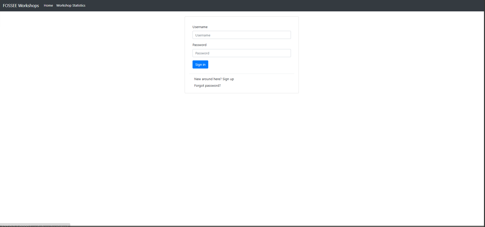
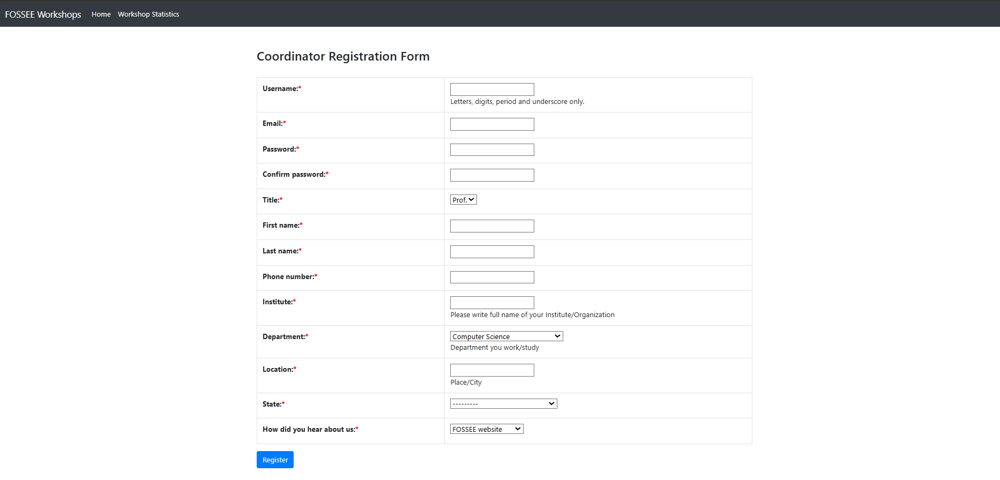

<div align="center">

#  FOSSEE Workshop Booking Platform — UI/UX Enhancement

[](LICENSE)
[]()
[]()
[](https://fossee.in)

> A modern UI/UX enhancement layer for the FOSSEE Workshop Booking Platform —  
> cleaner layouts, smarter forms, and a fully responsive interface —  
> built to improve usability without breaking existing workflows.

</div>

---

##  Table of Contents

- [Overview](#overview)
- [What's New](#whats-new)
- [Design Principles](#design-principles)
- [Responsiveness](#responsiveness)
- [Setup](#setup)
- [Trade-offs](#trade-offs)
- [Challenges](#challenges)
- [Screenshots](#screenshots)

---

## 🌟 Overview

This project enhances the UI/UX of the FOSSEE Workshop Booking Platform while **preserving the original structure and workflow**. The focus is on improving usability, readability, responsiveness, and overall user experience with a clean and modern interface — no rewrites, only thoughtful improvements.

---

## ✨ What's New

| Area | Improvement |
|------|-------------|
| 📐 **Layout & Spacing** | Improved visual rhythm and content density across all pages |
| 📝 **Enhanced Forms** | Login, Account, Personal, Professional, and Location — all redesigned |
| 🔺 **Visual Hierarchy** | Consistent headings, alignment, and typographic scale |
| ✅ **Validation** | Password confirmation check with clear error states |
| 💬 **User Feedback** | Success/error messages on all interactive elements |
| ✨ **Micro-interactions** | Smooth focus, hover, and button press transitions |
| 📱 **Responsive Design** | Mobile-first layout using Flexbox and CSS Grid |

---

## 🎨 Design Principles

Clarity      →  Simplified layout for easy understanding at a glance
Consistency  →  Uniform spacing, colors, and component patterns
Minimalism   →  Clean UI — nothing that doesn't serve the user
Feedback     →  Every interactive element responds to user actions
Accessibility→  Better readability and touch-friendly interactions

---

## 📱 Responsiveness

The interface adapts across all screen sizes using modern CSS:

- Mobile-friendly layout with touch-friendly spacing
- Simplified navigation on smaller screens
- Flexible components via **CSS Flexbox** and **CSS Grid**
- Consistent experience across mobile, tablet, and desktop

---

## ⚙️ Setup

```bash
# 1. Clone the repository
git clone https://github.com/Jaidhuria/Fossee-UI-UX-Enhancment

# 2. Navigate into the project directory
cd fossee-booking-ui

# 3. Install dependencies
npm install

# 4. Start the development server
npm run dev
```

> 💡 Open [http://localhost:3000](http://localhost:3000) in your browser to view the app.

---

## ⚖️ Trade-offs

-  No heavy animations — **performance comes first**
-  Clean, simple UI over visual complexity
- Minimal external libraries to keep the bundle lean
- Usability prioritized over decorative effects

---

## 🚧 Challenges

Enhancing the UI while **keeping the original project structure intact** was the primary challenge.

---

## 📸 Screenshots

### Original UI

| Login Page | Registration Page |
|---|---|
|  |  |

### Enhanced UI

| Login Page | Registration Form | Responsive View |
|---|---|---|
|  |  |  |

---

## 📄 License

Distributed under the [MIT License](LICENSE).  
Built for [FOSSEE, IIT Bombay](https://fossee.in).
